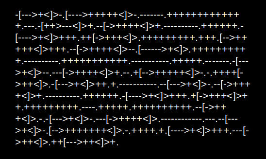

# Awesome Esolangs

  

Curated list of awesome esoteric programming languages and resources.

Explore creative and unconventional languages that challenge traditional logic and inspire new ways of thinking about code and computation.

> An esoteric programming language, or esolang, is a computer programming language designed to experiment with weird ideas, to be hard to program in,
> or as a joke, rather than for practical use. 

## Contents
* [Esolangs](#esolangs)
* [Resources](#resources)
* [Articles](#articles)
* [Books](#books)
* [Community](#community)

## Esolangs

* [Ajsone](https://www.quaxio.com/ajsone) - Language defined completely in JSON.
* [ArnoldC](https://esolangs.org/wiki/ArnoldC) - Based on the best one-liners of Arnold Schwarzenegger.
* [Asciidots](https://esolangs.org/wiki/AsciiDots) - Esolang inspired by ASCII art.
* [Befunge](https://esolangs.org/wiki/Befunge) - Two-dimensional language.
* [BIRL](https://birl-language.github.io/) - Language inspired by a [YouTube video](https://www.youtube.com/watch?v=zwvsa7DzzHY) that went viral, and many of its commands are quotes from the video.
* [Brain](https://esolangs.org/wiki/Brain) - An esoteric programming language compiler on top of LLVM based on Brainfuck.
* [Brainfuck](https://esolangs.org/wiki/Brainfuck) - Minimalist language using only 8 single-character commands.
* [Charcoal](https://github.com/somebody1234/Charcoal) - Concise language for sketching ASCII art.
* [Chef](http://www.dangermouse.net/esoteric/chef.html) - Programs that look like cooking recipes.
* [Chicken](https://esolangs.org/wiki/Chicken) - Only 1 valid symbol: 'chicken'.
* [ChuckScript](https://github.com/angrykoala/chuckscript) - Unary-based language, where the code is a single number.
* [DNA#](https://esolangs.org/wiki/DNA-Sharp) - Language based on the structure of the DNA.
* [Dots](https://github.com/josconno/dots) - A turing-complete language with only one symbol: ".".
* [Emojicode](http://www.emojicode.org) - Full-blown programming language consisting of emojis.
* [Enterprise™](https://github.com/joaomilho/Enterprise) - Non deterministic unnecessarily statically typed language.
* [False](http://strlen.com/false-language) - Heavily offuscated language with a minimal implementation.
* [Fetlang](https://github.com/Property404/fetlang) - Designed such that source code looks like poorly written fetish erotica.
* [FreakC](https://esolangs.org/wiki/FreakC) - Experimental Batch-like language written in Batch which compiles to Batch
* [Funciton](https://esolangs.org/wiki/Funciton) - Two-dimensional, minimalistic, declarative programming language 
* [Headache](https://github.com/LucasMW/Headache) - Programming Language that compiles to 8 Bit Brainfuck.
* [INTERCAL](http://www.catb.org/~esr/intercal/) - Parody language intended to be completely different from other languages.
* [JSFuck](https://esolangs.org/wiki/JSFuck) - Esoteric programming style based on the atomic parts of JavaScript.
* [LolCode](https://esolangs.org/wiki/LOLCODE) - Language with keywords based on the lolcat meme expressions.
* [Malbolge](http://www.lscheffer.com/malbolge.shtml) - Named after the 8th level of hell, is designed to be as difficult as possible to program.
* [Omgrofl](https://esolangs.org/wiki/Omgrofl) - Syntax resembling Internet slang.
* [Ook!](http://www.dangermouse.net/esoteric/ook.html) - Brainfuck-based language, where the commands are orangutan words.
* [Orca](https://esolangs.org/wiki/Orca) - Two-dimensional esoteric programming language in which every letter of the alphabet is an operation, where lowercase letters operate on bang, uppercase letters operate each frame.
* [reMorse](http://esolangs.org/wiki/reMorse) - Morse-styled language.
* [Rockstar](https://github.com/dylanbeattie/rockstar) - Designed for creating computer programs that are also song lyrics.
* [Piet](http://www.dangermouse.net/esoteric/piet.html) -  Language in which programs look like abstract paintings using colors as code. Named after Piet Mondrian.
* [Shakespeare](http://shakespearelang.sourceforge.net) - Language where the code appear to be Shakespearean plays.
* [Suzy](https://esolangs.org/wiki/Suzy) - 3D language inspired in Befunge.
* [Thue](https://esolangs.org/wiki/Thue) - Matrioshka language based on nondeterministic string rewriting which the author describes as a constraint-programming version of a Turing tarpit.
* [Unary](https://esolangs.org/wiki/Unary) - Brainfuck-based language where all the commands are 0.
* [Unlambda](https://esolangs.org/wiki/Unlambda) - minimal functional esoteric programming language based on combinatory logic. Notably, it was the first functional paradigm Turing tarpit.
* [Velato](https://esolangs.org/wiki/Velato) - Language that uses MIDI files as source, programs are defined by the pitch and order of notes.
* [Whenever](http://www.dangermouse.net/esoteric/whenever.html) - Language that does things whenever it wants.
* [Whitespace](http://web.archive.org/web/20150623025348/http://compsoc.dur.ac.uk/whitespace) - Use only white-characters (space, tabs and newlines).
* [Z](https://esolangs.org/wiki/Z) - Z is a programming language, which uses only lowercase and capital Z, space, and newline.

## Resources

* [Esolang](https://esolangs.org) - Wiki of esoteric programming languages and related Resources.

## Articles

* [The Aesthetics of Multicoding Esolangs)](https://stars.library.ucf.edu/cgi/viewcontent.cgi?article=1037&context=elo2020) - The aesthetics of multicoding esolangs article.

## Books
* [Strange Code: Esoteric Languages That Make Programming Fun Again](https://www.amazon.com/Strange-Code-Esoteric-Languages-Programming/dp/1718502400) - Strengthen your overall coding skills by exploring the wonderful, wild, and often weird world of esoteric languages.

## Community
* [Reddit Esolangs](https://www.reddit.com/r/esolangs) - Reddit community on esolangs.
